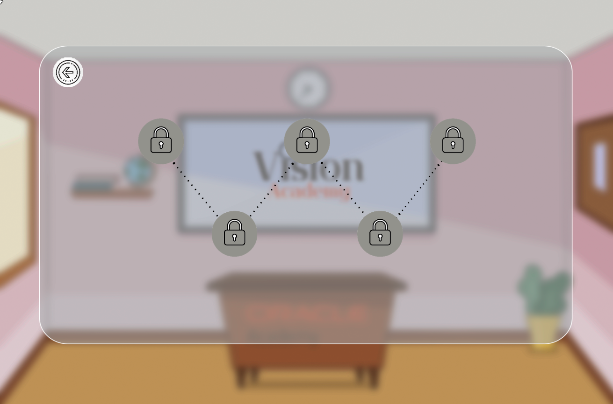

# GDD - Game Design Document - Módulo 1 - Inteli

## Tri-Database

## Integrantes
#### João Victor de Souza
#### Eduardo Faris Libutti Salles
#### Lucas Paiva Brasil
#### Lucas Cozzolino Tort
#### Mariella Sayumi Mercado Kamezawa
#### Nicolas Ramon da Silva
#### Rafaela Silva de Oliveira Lima

## Sumário

[1. Introdução](#c1)

[2. Visão Geral do Jogo](#c2)

[3. Game Design](#c3)

[4. Desenvolvimento do jogo](#c4)

[5. Casos de Teste](#c5)

[6. Conclusões e trabalhos futuros](#c6)

[7. Referências](#c7)

[Anexos](#c8)

 

# 1. Introdução 

Esta seção proporciona uma contextualização do jogo Vision Academy, abordando uma variedade de temas, tais como o contexto da indústria, as 5 forças de Porter, análise SWOT, matriz de risco, proposta de valor, entre outros temas. 

## 1.1. Escopo do Projeto

Este item aborda todo o planejamento e estrutura do projeto, proporcionando uma visão abrangente do jogo em sua totalidade.

### 1.1.1. Contexto da indústria 
 &nbsp;&nbsp;&nbsp;&nbsp; Esta seção busca contextualizar a Oracle Academy dentro do mercado em que está inserida.

&nbsp;&nbsp;&nbsp;&nbsp; A Oracle Academy é uma organização filantrópica da Oracle, ou seja, uma empresa sem fins lucrativos, que dedica-se ao ensino de tecnologia e computação para milhares de alunos em todo o mundo, oferecendo seus serviços de forma gratuita e com certificação internacional. Atuando em um mercado de rápido crescimento, o setor da educação em tecnologia. A empresa visa formar profissionais altamente capacitados para atender à crescente demanda do mercado. 

&nbsp;&nbsp;&nbsp;&nbsp;A iniciativa também se revela como uma excelente forma de promoção para a empresa, já que ao contribuir positivamente para a sociedade e ampliar o acesso à informação, ela naturalmente atrai tanto clientes quanto investidores. Esse aspecto não apenas torna a Academy viável, mas também potencialmente lucrativa, ao transformar seu impacto social em uma oportunidade monetizável.  A Oracle academy também enfrenta concorrência das principais empresas de tecnologia, tais como Microsoft, Google, Amazon Web Services (AWS), IBM e Salesforce, a Oracle Academy se destaca ao focar em seu core business: a educação, a qual distribui seus conteúdos por meio de parcerias estratégicas com instituições de ensino e educadores, visando gerar um fortalecimento de lealdade com os clientes e até mesmo recrutamento de talentos. 

&nbsp;&nbsp;&nbsp;&nbsp; Além disso, é importante destacar algumas tendências emergentes e potenciais mudanças na indústria. Entre elas, observamos a crescente relevância da inteligência artificial, que está mudando processos e sistemas em diversos setores. A computação em nuvem também se destaca como uma tendência que continua a ganhar mercado como mostrado em pesquisa realizada pela Gartner, empresa de consultoria, oferecendo flexibilidade, escalabilidade e acessibilidade a recursos de TI, e também pode-se citar a segurança cibernética,  que surge como uma prioridade cada vez maior, dada a crescente complexidade das ameaças digitais e a necessidade de proteger dados sensíveis e sistemas críticos contra ataques.

### 1.1.2 Forças de Porter 

&nbsp;&nbsp;&nbsp;&nbsp; As 5 forças de Porter é um modelo projetado para analisar a competitividade e o ambiente de uma indústria específica. 

### -Rivalidade entre concorrentes:

 &nbsp;&nbsp;&nbsp;&nbsp; Principais concorrentes: Plataformas para o treinamento e desenvolvimento de professores, juntamente com abordagens alternativas de aprendizado (dinâmicas e interativas), continuam a concorrer. 
 
 &nbsp;&nbsp;&nbsp;&nbsp; Nível de rivalidade: Mesmo que a Oracle Academy seja gratuita, a rivalidade pode ser intensa se os concorrentes oferecerem experiências de treinamento mais envolventes ou recursos adicionais. A participação de mercado e a atratividade da Vision Academy podem ser impactadas por isso.

### -Poder de barganha dos fornecedores:

 &nbsp;&nbsp;&nbsp;&nbsp; Principais fornecedores: A principal fornecedora da plataforma e recursos necessários é a Oracle.
 
 &nbsp;&nbsp;&nbsp;&nbsp; Poder de barganha dos fornecedores: Apesar da Oracle fornecer a plataforma de forma gratuita, ela continua tendo o poder de influenciar os termos do contrato e a disponibilidade dos recursos para a Vision Academy.

### -Poder de barganha dos compradores:

 &nbsp;&nbsp;&nbsp;&nbsp; Principais tipos de clientes: Os professores que usam a Oracle Academy são os principais clientes, e utilizam a Vision Academy como forma de conhecer a fundo todos os cursos e ferramentas disponíveis na plataforma .
 
 &nbsp;&nbsp;&nbsp;&nbsp; Poder de barganha dos clientes: Embora a Oracle Academy seja oferecida de forma gratuita, os professores podem procurar outras opções para treinamento e desenvolvimento se não estiverem satisfeitos ao passar pelo onboarding da Vision Academy.

### -Ameaça de novos entrantes:

 &nbsp;&nbsp;&nbsp;&nbsp; Obstáculos para novos entrantes: A criação de um Serious Game em primeira pessoa com mecânica específica não apenas demanda habilidades técnicas e criativas avançadas, mas também pode enfrentar desafios adicionais relacionados à integração com plataformas existentes e ao custo de desenvolvimento. Novos entrantes podem encontrar dificuldades significativas, especialmente se tiverem pouca ou nenhuma experiência prévia em programação e design de jogos. A falta de conhecimento nessas áreas pode aumentar a curva de aprendizado e tornar o processo de desenvolvimento mais desafiador. Superar esses obstáculos requer planejamento cuidadoso, colaboração eficaz e uma abordagem estratégica para o desenvolvimento do jogo.
 
 &nbsp;&nbsp;&nbsp;&nbsp; Impacto potencial dos novos entrantes: A competição entre plataformas de treinamento, mesmo com a Oracle Academy gratuita, pode levar novos concorrentes a oferecer experiências mais atrativas, potencialmente diminuindo a participação de mercado da Vision Academy. Isso poderia impulsionar a inovação na indústria, resultando em uma maior qualidade e variedade de recursos educacionais para os professores.

### -Ameaça de produtos ou serviços substitutos:

 &nbsp;&nbsp;&nbsp;&nbsp; Produtos ou serviços substitutos relevantes: Existem outros métodos de treinamentos e desenvolvimentos gratuitos de professores, tais como workshops presenciais, cursos online não-gamificados e outras plataformas de e-learning. 
 
 &nbsp;&nbsp;&nbsp;&nbsp; Nível de ameaça dos substitutos: A ameaça desses substitutos é significativa, especialmente quando oferecem atributos que a Vision Academy não possui, como interação direta com instrutores ou conteúdo altamente especializado.

### 1.1.3. Análise SWOT 

&nbsp;&nbsp;&nbsp;&nbsp; A análise SWOT tem como objetivo a análise das forças e fraquezas, das ameaças e das oportunidades de uma empresa ou projeto. Nesse sentido, as forças e fraquezas se referem ao ambiente interno, ou seja, aquilo que depende de ações internas para ser melhorado e as ameaças e as oportunidades se referem ao ambiente externo, ou seja, aquilo que não depende de ações internas dos gestores para a melhoria do projeto, visto que tais fatores são decorrentes do ambiente externo. Dessa forma, foi essencial a realização da análise no projeto.

Figura 1 - Análise SWOT

Fonte: Material produzido pelos autores (2024)

### Forças: 

&nbsp;&nbsp;&nbsp;&nbsp; - Reconhecimento: A Oracle possui uma reputação sólida e reconhecimento significativo no mercado de tecnologia, o que pode atrair usuários para sua plataforma de cursos;

&nbsp;&nbsp;&nbsp;&nbsp; - Variedade de cursos: A oferta diversificada de cursos pode atrair um grande número de profissionais, aumentando o apelo da plataforma;

&nbsp;&nbsp;&nbsp;&nbsp; - Direcionado à base de educação: O foco na base educacional pode criar uma conexão especial com estudantes e educadores, gerando confiança e lealdade.

### Fraquezas: 

&nbsp;&nbsp;&nbsp;&nbsp; - Dificuldade em manter o educador engajado: Se os educadores não estiverem envolvidos ou motivados, a qualidade do ensino e a atratividade da plataforma podem ser comprometidas; 

&nbsp;&nbsp;&nbsp;&nbsp; - Processo de criação de conta não intuitivo: Uma experiência de usuário complicada pode desencorajar potenciais usuários de se registrarem e explorarem a plataforma;

&nbsp;&nbsp;&nbsp;&nbsp; - Falta de divulgação fora da plataforma: A falta de divulgação em canais externos pode limitar o alcance da plataforma e sua capacidade de atrair novos usuários.

### Oportunidades: 

&nbsp;&nbsp;&nbsp;&nbsp; - Grande demanda por cursos EAD no mercado: A crescente demanda por educação online pode representar uma oportunidade significativa para a Oracle expandir sua base de usuários; 

&nbsp;&nbsp;&nbsp;&nbsp; - Crescente demanda por profissionais qualificados: A necessidade contínua de profissionais qualificados pode impulsionar a procura por cursos oferecidos na plataforma;

&nbsp;&nbsp;&nbsp;&nbsp; - Consumidores buscam empresas engajadas em causas sociais: O alinhamento com causas sociais pode diferenciar a Oracle e atrair consumidores que valorizam o compromisso com questões sociais.

### Ameaças: 

&nbsp;&nbsp;&nbsp;&nbsp; - Competição de cursos amplamente divulgados: Outras plataformas de cursos online com maior visibilidade podem representar uma competição forte pela atenção dos usuários;

&nbsp;&nbsp;&nbsp;&nbsp; - Suscetibilidade a decisões do MEC sobre cursos da área: Mudanças nas regulamentações ou políticas do Ministério da Educação podem afetar diretamente a oferta de cursos da plataforma, criando incertezas e desafios.

### 1.1.4. Descrição da Solução Desenvolvida 

&nbsp;&nbsp;&nbsp;&nbsp; Essa seção abordará a solução desenvolvida no jogo e como pode ser aproveitada pelo usuário.

&nbsp;&nbsp;&nbsp;&nbsp; A Oracle desenvolve um programa de capacitação de professores em programação, com o intuito de formar alunos já imersos no universo da tecnologia. No entanto, a empresa enfrenta um desafio significativo em manter esses professores motivados e comprometidos com os cursos oferecidos devido à confusão e complexidade da plataforma utilozada para acessar os materiais de estudo, o que impacta diretamente o objetivo final do programa.

&nbsp;&nbsp;&nbsp;&nbsp; Para abordar essa questão, foi concebido um jogo 2D em primeira pessoa, desprovido de personagens, composto por 5 fases distintas: registro, familiarização com as plataformas e recursos disponíveis, canais de comunicação, computação em nuvem e participação em sessões de suporte ao membro. O jogo apresenta uma dinâmica baseada em flash cards, que introduzem os recursos de forma interativa, e conta com um design neutro, alinhado à cultura da Oracle. Trata-se de um "serious game" que busca equilibrar o aprendizado com o engajamento dos participantes.

&nbsp;&nbsp;&nbsp;&nbsp; Os benefícios proporcionados pelos serious games são significativos: Promovem através das mecânicas do jogo uma aprendizagem ativa e engajante, permitindo que o usuário não se sobrecarregue na experiência do game e participem ativamente do processo educacional como mostrado em artigo publicado pela PUC-PR (30/08/2021). Tendo como exemplo a aquisição de um sistema de recompensa de medalhas, afim de ampliar o sentimento de engajamento do usuário. Além disso, muitos serious games são projetados para simular situações do mundo real, possibilitando que os usuários apliquem o conhecimento adquirido em ambientes controlados.

### 1.1.5. Proposta de Valor 
&nbsp;&nbsp;&nbsp;&nbsp; O "Canvas Proposta de Valor" é uma ferramenta utilizada no desenvolvimento e na descrição da proposta de valor de um produto ou serviço. Trata-se de uma estrutura de planejamento estratégico utilizada por empreendedores e empresas para visualizar e comunicar como uma empresa cria valor para seus clientes.

Figura 2 - Canvas da Proposta de Valor do Projeto

Fonte: Material produzido pelos autores (2024)

### 1.1.6. Matriz de Riscos 

&nbsp;&nbsp;&nbsp;&nbsp; Uma matriz de risco, é uma ferramenta usada na gestão de riscos para visualizar e priorizar os riscos enfrentados por um projeto. Ela ajuda a identificar e avaliar os riscos potenciais, bem como a determinar a melhor forma de lidar com eles. 

#### Ameaças:

\# | risco | impacto/probabilidade | plano de ação |
--- | --- | --- | --- |
1 | Dificuldade no acesso | Moderada/20% | O jogo terá o intuito de ensinar e explicar de forma didática e divertida para todos os usuários. |
2 | Ideia do jogo não agradar o usuário | Baixa/5% | Se o usuário não gostar da ideia de um jogo, pode-se jogar apenas a primeira fase (login na Oracle Academy). |
3 | O usuário não querer jogar ou ter dificuldade no jogo | Baixa/10% | Para aqueles que tiverem dificuldade no jogo, é recomendado que contatem o suporte. |
4 | Fortes concorrentes no mercado | Alto/50% | Com a forte concorrência no mercado, destaca-se pela boa jogabilidade, design e didática dentro da plataforma. |
5 | Limitação por faixa etária |  Muito Baixa/10% | A intenção primária é ensinar como usar a Oracle Academy de forma instrutiva, para que todos tenham a mesma experiência em nosso jogo. |
6 | Usuário não concluir o jogo | Baixa/20% | Utilizar de alertas de e-mail moderados para lembrar o usuário de concluir o jogo. |
7 | Sistema de recompensas não ser o suficiente para engajar o usuário | Moderado/20% | Aprimorar a mecanica de quizzes e puzzles a partir de estudos, com o objetivo de atingir o público alvo do projeto (professores). |
8 | Usuário não conseguir avançar nas fases | Muito baixo/5% | A partir dos dados de acertos e erros das fases, identificar as principais fases nas quais os usuários tiveram dificuldades em avançar, e diminuir a dificuldade dos puzzles e quizzes. |

#### Oportunidades:

\# | risco | probabilidade | plano de ação |
--- | --- | --- | --- |
1 | Novos investidores para a plataforma | Alta/70% | Com a nova tendência dos Serious Games, espera-se a chegada de novos investidores para a Oracle Academy. |
2 | Presença em salas de aula | Moderada/30% | Logo após o usuário terminar de jogar, recomenda-se a Oracle Academy como ferramenta para a sala de aula. |
3 | Presença nas empresas(treinamento) | Moderada/20% | Logo após o usuário terminar de jogar, recomenda-se a Oracle Academy como ferramenta para a sala de aula. |
4 | Adesão de professores | Alta/60% | Como a Oracle Academy é direcionada para professores, espera-se um fluxo elevado de novos educadores na Oracle Academy. | 
5 | Novas fases/projetos | Alto/50% | Criação e desenvolvimento de novas fases e cenários, caso haja uma alta adesão do público. |
6 | Novos conteúdos | Muito Alto/90% | Caso nosso jogo tenha muitos usuários, porém poucos logins na Oracle Academy, é recomendável atualizar o conteúdo para torná-lo mais direcionado à criação de contas. |

## 1.2. Requisitos do Projeto 

&nbsp;&nbsp;&nbsp;&nbsp; Na tabela estão expressos os requisitos exigidos pela Oracle Academy para o projeto. Esses requisitos são obrigatórios no jogo. 

Tabela 01 - Requisitos projeto 

\# | descrição |
--- | --- |
1 | Deve ser um Serious Game
2 | Não deve possuir personagem (cliente ficou mais flexível nesse quesito)
3 | Deve ser web
4 | Deve possuir a indentidade visual da Oracle
5 | Deve possuir visual sóbrio
6 | O Jogo deve ser em primeira pessoa, tendo o professor como protagonista.

Fonte: Material produzido pelos autores (2024)

## 1.3. Público-alvo do Projeto 

&nbsp;&nbsp;&nbsp;&nbsp; Esse item descreve o público-alvo do jogo Vision Academy. O público-alvo é o principal grupo de usuários para quem o jogo é destinado. 

&nbsp;&nbsp;&nbsp;&nbsp; A plataforma pode atender professores de diversas regiões geográficas, com foco principal em grandes cidades,  áreas onde a educação é prioridade e regiões que necessitam de melhora na educação. O público alvo do jogo são os professores (sejam acadêmicos da rede privada ou pública), sendo o perfil do nosso professor: entusiasta do mundo da tecnologia ou procura entrar nesse mundo, professores predominantemente jovem, de 22 até mesmo de 65 anos, e um perfil de professor inovador, com uma perspectiva emergente sobre tecnologia: um  potencial de transformar o mundo e ,principalmente, a vida de seus alunos. A plataforma engloba as preferências dos professores, tanto aqueles que estão acostumados com a tecnologia quanto aqueles que são iniciantes ou não têm o costume com a tecnologia. Os professores que estão confortáveis com a tecnologia podem preferir aulas ou cursos mais avançados, enquanto, o outro perfil pode preferir uma abordagem mais amigável, didática e simples. 

# 2. Visão Geral do Jogo 

&nbsp;&nbsp;&nbsp;&nbsp; Esta seção apresenta todos os aspectos da jogabilidade, incluindo a proposta do jogo, a plataforma que será utilizada e as inspirações por trás do desenvolvimento do jogo.

## 2.1. Objetivos do Jogo 

&nbsp;&nbsp;&nbsp;&nbsp; Nessa seção, são descritos os principais objetivos do jogo. Os objetivos do jogo são fundamentais para entender como ele irá se comunicar com o público. 

&nbsp;&nbsp;&nbsp;&nbsp; Desenvolver um serious game que mostre de maneira clara e engajadora todos os conteúdos disponibilizados na plataforma da Oracle Academy aos quais os professores têm acesso ao se tornarem membros do programa, incentivando sua utilização. Fazer um game que integre o professor na plataforma, de forma informativa e gamificada que possua uma estética sóbria e aquarelada com texturas próximas a identidade visual da Oracle Academy, sem personagens e com o professor como protagonista do jogo, onde o obejtivo final é a compreensão por completo dos conteúdos, como criar canais na plataforma, participação em sessão ao membro e como criar uma conta Oracle cloud. 

## 2.2. Características do Jogo 

&nbsp;&nbsp;&nbsp;&nbsp; As características do jogo englobam todas as informações sobre a maneira como o jogo será jogado e as diversas formas de jogabilidade disponíveis.

### 2.2.1. Gênero do Jogo 

&nbsp;&nbsp;&nbsp;&nbsp; O termo "gênero de jogo" se refere às categorias ou classificações atribuídas aos jogos com base em características específicas, como jogabilidade, enredo, mecânicas, temática e outros elementos. 

&nbsp;&nbsp;&nbsp;&nbsp; O gênero escolhido para o projeto é o “serious game” , baseado no que o público alvo deseja e no que a própria Oracle apresentou, por esse motivo foi definido esse tipo de jogo. A definição de serious game ou jogo sério é:[1] serious game refere-se a jogos digitais desenvolvidos com o propósito principal de fornecer uma experiência educacional, informativa e/ou de treinamento, em contraste com jogos desenvolvidos para o entretenimento. 
 
### 2.2.2. Plataforma do Jogo 

&nbsp;&nbsp;&nbsp;&nbsp; A plataforma de um jogo engloba o ambiente no qual o jogo é criado, distribuído e jogado. Isso inclui tanto o hardware quanto o software necessários para a execução do jogo.

&nbsp;&nbsp;&nbsp;&nbsp; O jogo será disponibilizado via desktop e mobile, onde o professor poderá ter acesso em qualquer lugar ou hora. Disponibilizados nos sistemas web, Android e IOS. 

### 2.2.3. Número de jogadores 

&nbsp;&nbsp;&nbsp;&nbsp; Este elemento aborda o número de jogadores que podem participar do jogo, seja simultaneamente em modo multiplayer ou individualmente em modo single player.

&nbsp;&nbsp;&nbsp;&nbsp; O game será com apenas um jogador controlável, sendo este o professor e o centro da experiência gamificada. 

### 2.2.4. Títulos semelhantes e inspirações 

&nbsp;&nbsp;&nbsp;&nbsp; Nesta seção, são descritas algumas inspirações ou jogos que compartilham semelhanças com o Vision Academy. 

&nbsp;&nbsp;&nbsp;&nbsp; O nosso grupo se inspirou no jogo Carto para fazer animações em quadro e na cencept art do jogo que se assemelha com a identidade visual da Oracle Academy.

### 2.2.5. Tempo estimado de jogo 

&nbsp;&nbsp;&nbsp;&nbsp; Este item descreve a duração estimada para que o usuário percorra o jogo do início ao fim. Essa informação auxilia na compreensão do nível de envolvimento proporcionado pelo jogo. 

 &nbsp;&nbsp;&nbsp;&nbsp; O jogo pode ser concluído em 15 minutos passando por todas as 5 fases. Cada fase possui 3 min de duração em média. 

# 3. Game Design 

&nbsp;&nbsp;&nbsp;&nbsp; Esta seção aborda os elementos-chave que compõem o jogo, incluindo o design do mapa, personagens, NPCs, enredo e outros elementos que foram fundamentais para o desenvolvimento do projeto.

## 3.1. Enredo do Jogo 

&nbsp;&nbsp;&nbsp;&nbsp;  No jogo, o jogador assume o papel de um professor que deseja ingressar na Oracle Academy. Para isso, é apresentado um óculos de realidade virtual, que o transporta para um mundo futurista. Logo após ativar os óculos, uma figura virtual se apresenta como guia: Vision. Ela oferece conselhos e instruções enquanto o jogador explora os ambientes e funcionalidades da Academy. Durante esse processo, o professor encontra flashcards digitais contendo informações sobre a criação de conta, canais, inscrição em cursos e navegação pelos conteúdos. A guia virtual utiliza o conteúdo dos flashcards para criar quizzes e puzzles, testando a compreensão do professor sobre a Oracle Academy. Com a orientação da guia virtual e a dedicação do jogador, a experiência no Onboarding do programa filantrópico da Oracle será facilitada e simplificada.

## 3.2. Personagens 

&nbsp;&nbsp;&nbsp;&nbsp; Esta seção descreve se o jogo contará com personagens e as possíveis formas de interação com eles.

&nbsp;&nbsp;&nbsp;&nbsp; A única personagem presente no jogo é a Vision, que possui um visual inspirado na personagem Eva do filme Wall-E, tendo um corpo mais arredondado e uma "cabeça" que remete a letra "O" utilizada pela Oracle. Vision atua como guia do professor nas salas de servidor, dando conselhos e tarefas, ela se torna controlável no minigame da invasão hacker e no minigame para atingir a sala cloud. As versões de design da personagem podem ser conferidas na sessão 4.0.

### 3.2.1. Controláveis

&nbsp;&nbsp;&nbsp;&nbsp; Esse item descreve todos os personagens controláveis do jogo, ou seja, qualquer personagem que o usuário possa controlar dentro do jogo. 

&nbsp;&nbsp;&nbsp;&nbsp; A princípio, o jogo é concebido para que o professor que deseja aprimorar seus conhecimentos em tecnologia se envolva de forma direta com a experiência oferecida. No entanto, ao longo do jogo, a "Vision", inicialmente apresentada como uma assistente virtual, se torna uma personagem controlável em um mini game específico, no qual o jogador assume o controle.

### 3.2.2. Non-Playable Characters (NPC)

&nbsp;&nbsp;&nbsp;&nbsp; NPC é a sigla para "Personagem Não Jogável". São personagens presentes dentro do jogo que não são controlados pelo jogador. Em vez disso, suas ações são determinadas pelo próprio jogo, seguindo rotinas ou scripts previamente definidos. 

&nbsp;&nbsp;&nbsp;&nbsp; O grupo concluiu que o jogo não contará com NPCs. Apesar da existência da guia (Vision), ela se torna jogável em 2 momentos do jogo, fazendo com que ela não possa ser considerada um NPC.

### 3.2.3. Diversidade e Representatividade dos Personagens

&nbsp;&nbsp;&nbsp;&nbsp; Nesta seção, abordamos a representatividade e diversidade dos personagens em relação ao público-alvo do jogo. Isso significa considerar  elementos do jogo que possam fazer com que o usuário se sinta representado enquanto joga. 

&nbsp;&nbsp;&nbsp;&nbsp; O jogo foi feito de forma a garantir acessibilidade para o público que utiliza a Oracle Academy, professores interessados em ensinar tecnologia de todas as regiões do Brasil. Para isso, foram incorporadas legendas para auxiliar aqueles com problemas auditivos em uma possível adição de falas da personagem Vision, promovendo inclusão e garantindo que todos os profissionais da educação tenham acesso igualitário ao conteúdo. Além disso, o design buscou utilizar tons neutros onde fosse possível para evitar sobrecarga sensorial, seguindo os princípios da psicologia das cores, de Eva Heller. 
Os textos do jogo empregam uma linguagem simples, seguindo estratégias recomendadas em página publicada pelo The Speaker (01/07/2023). Eles são informativos, evitando jargões técnicos que serão introduzidos nos cursos da academy. O objetivo é garantir o entendimento das questões nesta primeira interação. Essa abordagem busca criar um ambiente acolhedor e atraente para os jogadores, independente de suas origens ou níveis de habilidade, proporcionando uma experiência de aprendizado inclusiva e acessível para todos os professores interessados em tecnologia no Brasil. 

## 3.3. Mundo do jogo 

&nbsp;&nbsp;&nbsp;&nbsp; Este elemento descreve a ambientação do jogo de maneira abrangente, além de apresentar as diversas formas de interações possíveis durante o jogo.

### 3.3.1. Locações Principais e/ou Mapas 

&nbsp;&nbsp;&nbsp;&nbsp; Este elemento se relaciona com o ambiente onde o jogo acontece, mencionando algumas localidades e/ou o mapa do jogo. 

&nbsp;&nbsp;&nbsp;&nbsp; 1) Mapa de fases: Botão adicional do mapa de fases (no canto superior direito) onde o mapa de fases aparece no quadro da tela inicial.

&nbsp;&nbsp;&nbsp;&nbsp; 2) Tela inicial: O jogo começa com um cenário de sala aula comum em primeira pessoa, uma mesa e um óculos virtual sobre ela onde o personagem clica nele e começa a animação em primeira pessoa do óculos se aproximando até dar a sensação de encaixe no rosto.

&nbsp;&nbsp;&nbsp;&nbsp; 3) Fase 1: Após colocá-lo o professor entra na realidade virtual da Oracle Academy, onde surge uma assistente virtual do jogo chamada Vision que guiará o professor nessa jornada virtual e , assim, começa a fase de cadastro em outra sala de aula mas totalmente tecnológica, em que o professor coloca seu nome e e-mail e já avança para a próxima fase.

&nbsp;&nbsp;&nbsp;&nbsp; 4) Fase 2 e Fase 3 : um cenário repleto de servidores onde começa a navegação pelos conteúdos Oracle por meio de flash cards espalhados no cenário onde terão quizes ao longo do texto para engajar o professor e medalhas que recompensam o professor por performance, fazendo-o compreender os recursos disponibilizados na plataforma, já que o personagem só avança se acertar um número mínimo de quizzes. Ao passar para a terceira fase o jogador entra em um outro cenário de servidor onde irão ser apresentados conteúdos em flash cards e puzzles para engajar o professor sobre como criar canais e incluir conteúdos nos canais.

&nbsp;&nbsp;&nbsp;&nbsp; 5) Fase 4 e Fase 5: o jogador muda de cenário para outro em um ambiente de nuvem, onde vai ser a quarta e quinta fase do serious game, em que conteúdos informativos por meio de cards vão ser disponibilizados para informar a criação de conta em cloud e participação de sessão de membro e após essa última fase o jogador faz a animação de tirar o óculos em primeira pessoa em forma de quadrinho, passando de volta para o primeiro cenário de sala de aula.

### 3.3.2. Navegação pelo mundo 

&nbsp;&nbsp;&nbsp;&nbsp; Nesta seção, são descritos os caminhos que o jogador deve percorrer nos ambientes do jogo, bem como quaisquer limitações que o jogador possa encontrar ao longo do caminho. 
   
&nbsp;&nbsp;&nbsp;&nbsp; O jogador terá a oportunidade de movimentar seu personagem usando as teclas direcionais do teclado em dois momentos durante o jogo: o minigame da invasão hacker e o minigame para alcançar a sala cloud. Além disso, à medida que o jogador avança no jogo, ele será guiado pelas fases, cada uma com objetivos específicos a serem cumpridos. Para progredir de uma fase para outra, serão necessários requisitos mínimos, como acertar pelo menos um terço dos quebra-cabeças e completar a leitura dos flashcards. O fluxo do jogo levará o jogador da fase 1, onde ocorre o cadastro, para a fase 2, centrada em quizzes e flashcards que ajudarão na familiarização com a plataforma da Oracle Academy. Em seguida, o jogador avançará para a fase 3, que também consistirá em quizzes e flashcards, mas agora focados na demonstração da criação de canais e na adição de conteúdos neles. Posteriormente, o jogador passará para a fase 4 e então para a última fase que não foi incluida no MVP.

### 3.3.3. Condições climáticas e temporais 

&nbsp;&nbsp;&nbsp;&nbsp; Este item descreve as condições climáticas presentes no jogo, se houver alguma condição climática incluída na experiência. 

&nbsp;&nbsp;&nbsp;&nbsp; O jogo é ambientado em lugares fechados e sem visão para a área externa. 
 
### 3.3.4. Concept Art 

&nbsp;&nbsp;&nbsp;&nbsp; Concept art,  é uma forma de ilustração usada para transmitir uma ideia visualmente durante o processo de desenvolvimento de um projeto, como um filme ou um jogo. Essas ilustrações são criadas para explorar visualmente conceitos como personagens, cenários e atmosferas antes que sejam finalizados e implementados no produto final. 

Figura 3 - Concept Art

Fonte: Material produzido pelos autores (2024)

&nbsp;&nbsp;&nbsp;&nbsp; Na concept art existem diversos elementos dentre eles: sala de aula, barra de progresso, botão de jogar, medalha, certificado da oracle, nuvens, óculos VR, caixa de diálogo, logo das instituições e do nosso grupo e também o servidor. O grupo definiu os elementos da concept art da seguinte forma:

&nbsp;&nbsp;&nbsp;&nbsp; (1) Servidor: O servidor é o cenário em que vai passar as fases 1, 2, 3 e 4, a imagem da concept art foi uma inspiração para o nosso cenário atual.

&nbsp;&nbsp;&nbsp;&nbsp; (2) Sala de aula: O objetivo do projeto é engajar o professor para utilizar a Oracle Academy e posteriormente ensinar o que aprendeu na Oracle para os seus alunos, por conta disso foi adicionado a professora na sala de aula.  

&nbsp;&nbsp;&nbsp;&nbsp; (3) Barra de progresso: A barra de progresso foi uma das principais formas de engajar o usuário na plataforma.  

&nbsp;&nbsp;&nbsp;&nbsp; (4) Botão de jogar: A ideia inicial do projeto era ter o botão (jogar) para iniciar o jogo , porém foi descartada a ideia, mas foi adicionado na concept art como forma de inspiração para o projeto atual. 

&nbsp;&nbsp;&nbsp;&nbsp; (5) Medalha: A medalha é outro elemento de engajamento do usuário, é utilizado no jogo como forma de recompensa. 

&nbsp;&nbsp;&nbsp;&nbsp; (6) Certificado Oracle: Na concept art foi adicionado o certificado internacional da Oracle, quando o usuário termina um curso na Oracle ele recebe esse certificado. 

&nbsp;&nbsp;&nbsp;&nbsp; (7) Nuvens: As nuvens são uma marca registrada da Oracle, então foi adicionado na concept art com finalidade de familiarizar o usuário com a Oracle.  

&nbsp;&nbsp;&nbsp;&nbsp; (8) Óculos VR: O óculos de realidade virtual é a marca registrada do jogo Vision Academy. 

&nbsp;&nbsp;&nbsp;&nbsp; (9) Caixa de diálogo: A primeira interação do usuário com a assistente virtual do jogo. 

&nbsp;&nbsp;&nbsp;&nbsp; (10) Logos: Na concept art foi adicionado os logos da Inteli e do grupo Tri-Data Base em uma nuvem. 

### 3.3.5. Trilha sonora 

&nbsp;&nbsp;&nbsp;&nbsp; Este elemento engloba a descrição de algumas trilhas sonoras presentes durante o jogo, além de descrever as situações em que essas trilhas sonoras são utilizadas. 

Tabela 02 - Tabela trilha sonora 

\# | titulo | Autoria | Descrição | Ocorrencia |
--- | --- | --- | --- | --- |
1 |  Trilha sonora tela inicial | Pixabay Sound Effects Free License | Música tranquila e calma. Seu estilo é semelhante ao de algumas telas iniciais de jogos de arcade. | Música da tela inicial, usada apenas na tela inicial|
2 | Trilha sonora da animação do óculos | Pixabay Sound Effects Free License | Esta trilha sonora lembra alguns jogos de exploração, mas com um tom mais tecnológico. | presente durante grande parte do jogo, ela começará assim que o usuário clicar nos óculos e terminará antes da fase 5.|
3 | Trilha sonora sala cloud | Pixabay Sound Effects Free License | possui um tom angelical, criando um ambiente calmo e tranquilo, o que complementa a atmosfera da sala cloud |Permanece durante toda a fase 5 (sala cloud)|

Fonte: Material produzido pelos autores (2024)

### Efeitos sonoros:

Tabela 03 - Tabela efeitos sonoros 

\# | titulo | Autoria | Descrição | Ocorrencia |
--- | --- | --- | --- | --- |
1 | Mouse click | Pixabay Sound Effects Free License | som clássico de um clique de mouse. | Este som é reproduzido ao clicar com o mouse dentro do jogo. |
2 | Efeito sonoro de pular | Items under the Mixkit Sound Effects Free License can be used in your commercial and non-commercial projects for free. | Som utilizado em jogos arcades quando o player pula. | Esse som é acionado ao pular dentro dos minigames |
3 | Som de game win | Items under the Mixkit Sound Effects Free License can be used in your commercial and non-commercial projects for free. | Esse é um som comum com o som de vitória de puzzles. | O som é emitido sempre que o jogador ganhar os minigames. |
4 | Som de game over | Items under the Mixkit Sound Effects Free License can be used in your commercial and non-commercial projects for free. | Este é um som semelhante ao som de derrota de alguns jogos. | O som é emitido sempre que o jogador perder os minigames.
5 | Efeito sonoro ao coletar as moedas no minigame do vírus. | Items under the Mixkit Sound Effects Free License can be used in your commercial and non-commercial projects for free.| Este é um som bem comum de “collect coin” usados em jogos tradicionais. | Esse som é emitido quando o jogador coleta a moeda do minigame do virus. |
6 | Botão de acerto nos puzzles | Applehillsstudios, Envato Elements Free License | Semelhante com o som de acerto de alguns puzzles. | O efeito é reproduzido assim que o jogador acertar os puzzles. |
7 | Botão de erro nos puzzles | Applehillsstudios, Envato Elements Free License | Semelhante com o som de erro de alguns puzzles.| O efeito é reproduzido assim que o jogador errar os puzzles.|
8 | Efeito sonoro de carta virando |  Pixabay Sound Effects Free License | Esse som é um som comum de uma carta sendo virada. | Quando a carta for virada esse som é emitido. | 

Fonte: Material produzido pelos autores (2024)

&nbsp;&nbsp;&nbsp;&nbsp; Essa tabela foi dividida em três principais temas: titulo, ocorrência e autoria. No tema titulo, foi introduzido o motivo da trilha sonora. Em ocorrência foi adicionado a cena em que essa trilha sonora está introduzida e por último a autoria são os donos do direito da música. 

## 3.4. Inventário e Bestiário 

&nbsp;&nbsp;&nbsp;&nbsp; Esta seção inclui todos os elementos que podem ser coletados ou encontrados durante o jogo.

### 3.4.1. Inventário

&nbsp;&nbsp;&nbsp;&nbsp; O inventário de um jogo é uma interface ou sistema que permite aos jogadores gerenciar e acessar os itens que coletaram ou adquiriram ao longo do jogo. Esses itens podem incluir armas, equipamentos, medalhas, chaves, recursos, missões, entre outros. No entanto, é importante ressaltar que, no caso deste jogo específico, não há uma variedade de itens no inventário. Em vez disso, o jogo se concentra em recompensar os jogadores com medalhas por completarem desafios específicos. Essas medalhas funcionam como símbolos de conquista e recompensas pelos desafios superados. A tabela a seguir apresenta melhor como funcionam as premiações.

###  Tabela - Inventário 

Tabela 04 - Tabela inventário

\# | item | imagem | como obter | função | efeito sonoro
--- | --- | --- | --- | --- | ---
1 | Medalha primeiro quiz | | Ao realizar o primeiro quiz | Engajar e recompensar uma boa performance | Não possui
2 | Medalha último quiz |  | Realizar o último quiz | Recompensar o jogador que realiza o puzzle | Não possui
3 | Medalha jogo da memória |  | Concluir o puzzle do jogo da memória | Feedback ao jogador que terminou o puzzle | Não possui |
4 | Medalha do jogo virus |  | Ao acabar o jogo virus | Recompensar o usuário que ganhou o minigame | Efeito sonoro de game win |
5 | Medalha sala cloud |  | Ao concluir o minigame cloud | Engajar o usuário | Efeito sonoro game win | 
6 | Medalha puzzle |  | Ao concluir o puzzle de ligar a imagem ao texto | Recompensar o jogador que concluir o puzzle | Efeito sonoro game win |

Fonte: Material produzido pelos autores (2024)

### 3.4.2. Bestiário

&nbsp;&nbsp;&nbsp;&nbsp; Um bestiário em um jogo é um catálogo  que contém informações sobre as diversas criaturas ou inimigos encontrados ao longo do game.
&nbsp;&nbsp;&nbsp;&nbsp; No jogo, há apenas um inimigo, representado pelo vírus, que está presente no primeiro minigame. Sua principal função é dificultar a coleta de todos os raios pela personagem Vision, tornando a tarefa mais complexa. Essa dinâmica acrescenta um elemento de desafio ao jogo, exigindo que o jogador evite o vírus enquanto tenta completar o objetivo do minigame.
Na Vision Academy
\# | inimigo | ocorrência | função  | impacto | efeito sonoro
--- | --- | --- | --- | --- | ---
1 | Vírus | | No primeiro minigame |impedir que a personagem  colete todos os raios sem entrar em contato com ele| Se a personagem encostar no inimigo, ela perde e o jogo é reiniciado

## 3.5. Gameflow (Diagrama de cenas) 

&nbsp;&nbsp;&nbsp;&nbsp; Gameflow, é um termo que se refere à sequência de eventos e ações que os jogadores experimentam ao longo da partida. Envolve a estruturação da jogabilidade desde o início até o final do jogo, incluindo a progressão do jogador, os desafios enfrentados, as decisões tomadas e as recompensas obtidas.

&nbsp;&nbsp;&nbsp;&nbsp; O jogo inicia em uma sala de aula comum, vista em primeira pessoa, onde há uma mesa contendo um óculos virtual. O personagem interage com o óculos, iniciando uma animação que simula seu encaixe no rosto. Ao colocá-lo, o professor adentra a realidade virtual da Oracle Academy, onde é recebido por uma assistente virtual chamada Vision, que o guiará nessa jornada. Assim, a fase de cadastro se inicia em uma sala de aula mais tecnológica, onde um tutorial sobre o registro na plataforma é apresentado.

&nbsp;&nbsp;&nbsp;&nbsp; Após o usuário fornecer suas informações de cadastro, como seu nome preferido, é redirecionado para a próxima etapa. Nesse ponto, é transportado para um cenário repleto de servidores, cada um contendo diferentes conteúdos da Oracle. Aqui, o usuário pode começar a explorar os materiais disponíveis, utilizando flash cards e participando de quizzes, recebendo medalhas como recompensa por seu desempenho.

&nbsp;&nbsp;&nbsp;&nbsp; Para avançar, o jogador deve demonstrar compreensão dos recursos oferecidos pela plataforma, acertando um número mínimo de perguntas nos quizzes. A cada fase concluída, um novo conteúdo é desbloqueado para que o usuário possa continuar sua aprendizagem por meio dos flash cards e quizzes.

&nbsp;&nbsp;&nbsp;&nbsp; Após completar as fases dentro do ambiente dos servidores, o jogador é levado para uma seção de nuvem, onde é ensinado a criar sua conta Cloud. Finalmente, retorna ao cenário inicial da sala de aula pronto para prosseguir para a plataforma Oracle Academy com toda a experiência de aprendizagem adquirida. Após o jogador  passar as fases que estão na sala de servidor ele será redirecionado para um ambiente de nuvem, onde vai ter as fases quatro e cinco que também irão ter flash cards e quizzes, porém relacionados a criação de contas cloud e participação de sessão de membro, em seguida, é mostrada uma animação em forma de quadrinhos do jogador tirando o óculos em primeira pessoa, assim voltando para o primeiro cenário de sala de aula. 

Diagrama de Cenas: (https://www.figma.com/file/9GfaJ7ltkaToi3PruVDq3x/Exemplo---Game-Flow-com-Storyboard-(Copy)?type=whiteboard&node-id=0-1&t=AAdvMuEqXhh86jEY-0 )

Diagrama de Cenas
 

 
Fonte: Material produzido pelos autores (2024)

## 3.6. Regras do jogo 

&nbsp;&nbsp;&nbsp;&nbsp; As regras de um jogo constituem um conjunto de diretrizes que determinam a maneira como o jogo é jogado e estabelecem as condições para ganhar ou perder. Elas estabelecem os limites e as restrições dentro das quais os jogadores podem interagir entre si e com o ambiente do jogo. 

&nbsp;&nbsp;&nbsp;&nbsp; Este jogo tem como finalidade ajudar os usuários a serem guiados através de diferentes fases para aprender e interagir com os recursos disponíveis. 

&nbsp;&nbsp;&nbsp;&nbsp; Na fase 1, os usuários são introduzidos ao sistema e ao jogo, e são apresentados aos conceitos básicos e à interface. Ao mesmo tempo, em que são realizado os cadastros dos usuários na plataforma do cliente.

&nbsp;&nbsp;&nbsp;&nbsp; Na fase 2, os jogadores precisam navegar pelos conteúdos e recursos disponíveis no sistema, o que inclui encontrar informações sobre os cursos oferecidos. Para avançar  para a próxima fase, os jogadores devem acertar um número mínimo de quizzes relacionados a esta fase, sendo aproximadamente  um terço do número total disponível.

&nbsp;&nbsp;&nbsp;&nbsp; Na fase 3, os jogadores são desafiados a criar canais ou grupos de estudo e a "inscrever-se" nos canais arrastando imagens para sua zona correta. Para progredir, eles precisam resolver o quebra-cabeça relacionado a esta fase.

&nbsp;&nbsp;&nbsp;&nbsp; Na fase 4, os jogadores precisam guiar a personagem vision até a porta no topo da sala, e então navegar pelos conteúdos e recursos disponíveis no sistema, o que inclui encontrar informações sobre os cursos oferecidos. Para liberarem e conseguirem responder o quiz, caso a resposta esteja correta o jogador é premiado.

 
## 3.7. Mecânicas do jogo 

&nbsp;&nbsp;&nbsp;&nbsp; As mecânicas de um jogo são os sistemas, regras e interações que controlam a jogabilidade e influenciam a experiência dos jogadores ao longo do jogo. Elas desempenham um papel fundamental na criação de desafios, oportunidades e momentos de diversão ao longo da jornada do jogador. 

&nbsp;&nbsp;&nbsp;&nbsp; Ao iniciar o jogo, o usuário será direcionado para a tela inicial, onde se deparará com uma sala de aula virtual. Na mesa do professor, há um par de óculos de realidade virtual. Ao clicar com o mouse nos óculos VR, o usuário terá a sensação de que os óculos se encaixam em seu rosto. Após colocá-los, o ambiente virtual do jogo se transforma, dando início à interação com uma assistente virtual chamada Vision, que guiará o usuário durante a jornada virtual. Começa então a fase de cadastro, na qual o usuário fornecerá seu nome e e-mail antes de avançar para a próxima etapa.

&nbsp;&nbsp;&nbsp;&nbsp; Nas fases seguintes, o usuário será transportado para cenários repletos de servidores, onde poderá navegar pelos conteúdos Oracle utilizando flash cards espalhados no ambiente. Ao longo do texto, haverá quizzes para engajar o usuário, e medalhas serão concedidas como recompensa por seu desempenho, incentivando-o a compreender os recursos disponíveis na plataforma. O progresso do usuário dependerá da sua capacidade de responder corretamente a um número mínimo de quizzes.

&nbsp;&nbsp;&nbsp;&nbsp; Após completar esta fase, o jogador será levado para um novo cenário, ambientado em uma nuvem, onde se desenrolarão as quarta e quinta etapas do jogo. Nestas fases, serão disponibilizados conteúdos informativos por meio de cards, informando sobre a criação de conta na nuvem e a participação em sessões de membros.

&nbsp;&nbsp;&nbsp;&nbsp; Após concluir a fase final, o jogador verá os créditos, seguidos por um retorno automático à tela inicial.

# 4. Desenvolvimento do Jogo
&nbsp;&nbsp;&nbsp;&nbsp; Nesta seção, serão abordados os aspectos relacionados ao processo de desenvolvimento do jogo, desde a concepção da ideia inicial até a implementação de funcionalidades específicas e elementos visuais. Aqui, são descritas as etapas principais, as ferramentas utilizadas, os desafios enfrentados e as soluções encontradas durante a criação do jogo, além de planos futuros. Dessa forma, ao contextualizar o desenvolvimento do jogo, os leitores podem entender melhor o processo criativo e técnico por trás da concepção e construção do produto final.

## 4.1. Desenvolvimento preliminar do jogo 

&nbsp;&nbsp;&nbsp;&nbsp; Nesta seção, são descritos os primeiros passos tomados pela equipe de desenvolvimento, as ideias iniciais, a elaboração do conceito do jogo e a definição das características básicas. O objetivo é oferecer uma visão geral do processo inicial de criação do jogo, destacando as decisões tomadas e os primeiros desafios enfrentados pela equipe.

&nbsp;&nbsp;&nbsp;&nbsp; O principal objetivo do desenvolvimento do jogo é apresentar de maneira clara e engajadora todos os recursos aos quais os professores têm acesso na plataforma Oracle Academy ao se tornarem membros do programa, incentivando sua utilização. Para atingir esse objetivo, o jogo foi pensado em um Serious Game em primeira pessoa, onde o professor, público-alvo do projeto, assume o papel de protagonista da experiência. E com a finalidade de projetar uma interface de jogo alinhada a identidade visual da empresa, foi utilizado HTML5 para estruturar a base do jogo e CSS para definir o layout. Para adicionar a mecânica do jogo, foi usado JavaScript como linguagem de programação em conjunto com a biblioteca Phaser.js, dessa forma incluindo eventos, gráficos 2D e física.   

&nbsp;&nbsp;&nbsp;&nbsp; A primeira tela inicial foi desenvolvida pelos membros do grupo para integrar ao jogo. Seu cenário apresentava elementos visuais que lembravam o estilo característico da Oracle, mas foi analisado que o design não se encaixava na proposta do jogo. Optou-se por revisar e adaptar a tela para uma estética mais alinhada com a experiência de aprendizado que se pretendia oferecer. Essa mudança foi crucial para garantir uma experiência coesa e imersiva para os jogadores.

Figura 1 - Tela inicial
 

 
Fonte: Material produzido pelos autores (2024)

&nbsp;&nbsp;&nbsp;&nbsp;  Com o objetivo de estabelecer uma conexão mais próxima entre o usuário e o jogo, foi planejado introduzir uma tela de cadastro. Essa tela consiste em uma imagem de uma sala tecnológica, com um efeito de desfoque aplicado para criar um fundo de cena envolvente. No centro da tela, foi projetado um flashcard onde o professor é questionado sobre seu nome, seguido por um espaço interativo para que ele possa digitar sua resposta.O propósito principal dessa tela é coletar o nome do usuário, que será utilizado ao longo das próximas fases do jogo, chamando o professor pelo seu próprio nome. Dessa maneira, fazendo com que ele se sinta mais envolvido na narrativa e no desenvolvimento da história.

Figura 2 - Tela de cadastro
 

  
Fonte: Material produzido pelos autores (2024)

&nbsp;&nbsp;&nbsp;&nbsp; 
O sistema de medalhas implementado no jogo é uma ferramenta fundamental para incentivar o professor a progredir e continuar sua jornada educacional dentro do jogo. A cada fase que é concluída com sucesso, o professor recebe uma medalha como reconhecimento por suas conquistas e progresso. Essas medalhas não apenas servem como uma forma de recompensa, mas também como um indicador do seu avanço no jogo.

Figura 3 - Medalha
 

 
Fonte: kenney.nl 

Próximos Passos:

&nbsp;&nbsp;&nbsp;&nbsp;  Pretende-se expandir a funcionalidade e o apelo do jogo, com a intenção de implementar animações mais complexas e engajadoras, como a representação de uma pessoa colocando um óculos de realidade virtual. Além disso, está planejado desenvolver um menu completo que exiba as medalhas e conquistas do jogador, proporcionando, assim, uma experiência de progressão significativa.

Desafios e Oportunidades:

&nbsp;&nbsp;&nbsp;&nbsp; São enfrentados desafios ao equilibrar a ambição do projeto com as limitações de tempo e recursos. No entanto, esses desafios são encarados como oportunidades para aprimorar as habilidades da equipe e fortalecer a colaboração entre seus membros. Isso permitirá que, na próxima Sprint, seja entregue algo além de um protótipo.

## 4.2. Desenvolvimento básico do jogo 

&nbsp;&nbsp;&nbsp;&nbsp; Este tópico, descreve o desenvolvimento básico do jogo, ou seja, são descritas todas as etapas básicas do jogo.

&nbsp;&nbsp;&nbsp;&nbsp; Desejando criar um ambiente familiar e acolhedor para os professores, foi decidido reformular e representar uma sala de aula como a tela inicial do jogo, proporcionando ao jogador uma visão em primeira pessoa. Assim, na segunda versão do primeiro cenário, incluímos uma mesa no centro da sala, sobre a qual está um óculos de realidade virtual. Ao clicar sobre esse óculos, uma representação por imagens se desencadeia, mostrando o usuário colocando-o. Com isto, o jogador é imerso na experiência do jogo, tornando sua jornada mais envolvente e protagonista. Além disso, há a adição de uma cadeira de estudante, uma lousa, bem como os logotipos da empresa parceira, a Oracle Academy, e do jogo, denominado "Vision Academy" pela equipe. Por último, foram adicionados botões para controle de volume, configurações e créditos, a fim de proporcionar uma experiência de usuário mais completa e intuitiva.

Figura 4 - Nova tela inicial
 

 
Fonte: Material produzido pelos autores (2024)

&nbsp;&nbsp;&nbsp;&nbsp;No jogo, foi implementado um modo interativo para simular o processo de colocar os óculos no usuário. Utilizando uma sequência de imagens progressivas, em cada imagem, os óculos se aproximam mais da tela do usuário. Essa progressão gradual reforça a sensação de movimento e proximidade, permitindo aos jogadores vivenciarem de forma visual e interativa o ato de colocar o óculos.

Figura 5 - Animação do óculos 1
 

 
Fonte: Material produzido pelos autores (2024)

Figura 6 - Animação do óculos 2
 

 
Fonte: Material produzido pelos autores (2024)

Figura 7 - Animação do óculos 3
 

 
Fonte: Material produzido pelos autores (2024)

&nbsp;&nbsp;&nbsp;&nbsp;   Após colocar o óculos, o professor é inserido em um mundo de realidade virtual, na qual é iniciado na tela de cadastro. O design da tela de cadastro permanece a mesma da sprint anterior.

Figura 8 - Tela de Cadastro
 

 
Fonte: Material produzido pelos autores (2024)

 
Dificuldades Encontradas:

&nbsp;&nbsp;&nbsp;&nbsp;Durante o desenvolvimento desta sprint, foi desafiador decidir a melhor forma de representar a cena em que o óculos é "inserido no usuário", levando em consideração os limites de conhecimento da equipe na área de programação. Essa etapa exigiu criatividade para encontrar uma solução adequada que atendesse às necessidades técnicas do projeto e às expectativas do jogo.

Próximos Passos:
&nbsp;&nbsp;&nbsp;&nbsp;Nos próximos passos do desenvolvimento, está prevista a reformulação da tela de cadastro, uma vez que foi concluído que a estética da sala tecnológica atual não está alinhada com o restante do jogo. Além disso, o foco principal será o desenvolvimento do primeiro tutorial, o tutorial de cadastro, com o objetivo de auxiliar os professores a utilizarem a plataforma Oracle Academy de forma eficaz e intuitiva. Essas iniciativas são fundamentais para aprimorar a experiência do usuário e garantir uma integração fluida entre o jogo e o ambiente educacional proposto.

## 4.3. Desenvolvimento intermediário do jogo 

&nbsp;&nbsp;&nbsp;&nbsp; O desenvolvimento intermediário do jogo refere-se às etapas principais do jogo, ou seja, são as etapas em que todo o processo do jogo é efetivamente desenvolvido.

&nbsp;&nbsp;&nbsp;&nbsp; Na terceira Sprint, ocorreu uma reformulação significativa da tela inicial do jogo novamente, com intuito de aprimorar sua identidade visual e torná-la mais atraente. Uma das melhorias implementadas foi a adição de elementos decorativos no cenário, como prateleira, quadro de recados, livros, vaso de planta e relógio, todos essenciais para criar uma atmosfera mais característica de uma sala de aula. Além disso, optamos por remover as texturas do cenário, com o objetivo de deixá-lo mais leve e harmonioso, favorecendo a clareza visual e a estética do ambiente. Outra mudança significativa foi a substituição da mesa e cadeira de aluno por uma mesa de professor, onde fica o óculos. Essa alteração não apenas reforça o papel do professor como protagonista do jogo, mas também torna a cena mais coesa e alinhada com o tema educacional do jogo.

 Figura 9 - Nova tela inicial
 

 
Fonte: Material produzido pelos autores (2024)

 &nbsp;&nbsp;&nbsp;&nbsp; Uma das principais entregas foi a implementação de uma  assistente virtual denominada Vision. A qual foi projetada para guiar o jogador por meio de balões de diálogo, oferecendo orientações em momentos estratégicos durante o jogo. O código da Vision foi feito com simplicidade, tornando-o facilmente replicável e escalável. Ele foi integrado ao jogo de forma a aparecer em momentos pré-definidos, conforme o progresso do jogador, sem interferir na jogabilidade principal. A interface de interação da Vision foi simplificada, apresentando diálogos de fácil compreensão para atingir um público mais amplo. Seus diálogos são direcionados para auxiliar o jogador a acessar os quizzes e flashcards disponíveis no jogo. 

 &nbsp;&nbsp;&nbsp;&nbsp;A imagem a seguir mostra a primeira interação da Vision com o usuário:

Figura 10 - Cadastro com a Vision 
 

 
Fonte: Material produzido pelos autores (2024)

&nbsp;&nbsp;&nbsp;&nbsp; Além da implementação da Vision e remodelação dos cenários, outra adição foi a criação de duas novas cenas de desafio. A primeira cena introduz um quiz, criado para testar o conhecimento do jogador sobre o processo de criação de contas. Já a segunda cena apresenta uma abordagem semelhante a um "carrossel", exibindo informações relevantes sobre o processo de criação de contas da Oracle Academy. Essas adições diversificam os desafios no jogo, e também oferecem aos jogadores momentos de aprendizado e engajamento com o conteúdo educacional da Oracle Academy.

Figura 11 - Imagem do carrosel 
 

 
Fonte: Retirada de documento cedido pela empresa parceira 

Figura 12 - Imagem do carrosel 
 

 
Fonte:Retirada de documento cedido pela empresa parceira

Figura 13 - Imagem do carrosel 
 

 
Fonte:Retirada de documento cedido pela empresa parceira

Dificuldades Encontradas:

&nbsp;&nbsp;&nbsp;&nbsp; Durante a implementação da Vision, uma das dificuldades enfrentadas foi garantir que sua presença não interferisse excessivamente na experiência de jogo. Sendo necessário ajustar o momento e a frequência de suas aparições para evitar distrações ao jogador.

Próximos Passos:

&nbsp;&nbsp;&nbsp;&nbsp; Para as próximas iterações, pretendemos aumentar o número de quizzes, adicionar puzzles, implementar um menu de fases, bem como aprimorar o design e integrar minigames no jogo.

## 4.4. Desenvolvimento final do MVP 

&nbsp;&nbsp;&nbsp;&nbsp; Na quarta sprint, o desenvolvimento do jogo avançou significativamente, com a implementação de diversas funcionalidades. Entre as principais adições destacam-se a criação de puzzles, quizzes e minigames, que proporcionam desafios interativos e estimulantes para os jogadores. Também foi desenvolvido um menu de fases, que permite aos jogadores navegar de forma intuitiva entre os diferentes desafios disponíveis. Além disso, foi implementada a fase cloud, na qual ocorre o tutorial de como criar uma conta Cloud. Essas adições contribuem para experiência do jogo, tornando-o mais envolvente para os jogadores. 

&nbsp;&nbsp;&nbsp;&nbsp; Com a intenção de proporcionar um processo de aprendizagem divertido e descontraído, apresenta-se  um modelo de carta projetado pelos alunos do grupo Tri-Database para ser utilizado em puzzles no estilo jogo da memória, com o propósito de apresentar os assuntos da Oracle Academy ao jogador. Cada carta contém um texto explicativo detalhando passo a passo as instruções que o usuário deve seguir para acessar os conteúdos. O objetivo consiste em encontrar duas cartas correspondentes para demonstrar o entendimento das instruções e, assim, acessar o conteúdo desejado. 

    Figura 14 - Carta jogo da memória
     
    
     

    Figura 15 - Jogo da memória
     
    
     
    Fonte: Material produzido pelos autores (2024)

&nbsp;&nbsp;&nbsp;&nbsp;Com o objetivo de integrar o visual do óculos apresentado na tela inicial à identidade do jogo, foram realizados aprimoramentos em seu design. Foi determinado que, após a mudança da tela inicial, o óculos precisava ser reformulado para seguir o alinhamento estético do cenário. Nesse sentido, as cores foram selecionadas de acordo com a identidade visual da Oracle, e um design 2D foi elaborado para garantir a harmonia com o restante do jogo.

    Figura 16 - Óculos de realidade virual reformulado
     
    
     
    Fonte: Material produzido pelos autores (2024)

&nbsp;&nbsp;&nbsp;&nbsp;Foi elaborada uma tela de menu de fases com o objetivo de tornar a trajetória do professor mais prática e organizada ao longo das etapas do jogo. Essa tela permite ao usuário visualizar de forma clara os conteúdos disponibilizados e sua progressão. Além disso, para desbloquear as fases, é necessário completar cada uma pelo menos uma vez. Isso garante que o jogador passe por todas as fases e compreenda todo o conteúdo oferecido pelo jogo de forma abrangente e completa.

    Figura 17 - Menu de fases
     
    
     
    Fonte: Material produzido pelos autores (2024)

&nbsp;&nbsp;&nbsp;&nbsp;Foi desenvolvido um novo tutorial para o Serious Game com o objetivo de tornar o processo de aprendizagem mais intuitivo e interativo. O foco era permitir que os professores pudessem aprender e compreender, de maneira realista, cada etapa, desde o cadastramento até a inscrição em cursos e outras funcionalidades. Essa abordagem foi adotada para atender aos requisitos do jogo e garantir uma experiência educacional eficaz e envolvente.

    Figura 18 - Nova forma de apresentar o tutorial 
     
    
     
    Fonte: Material produzido pelos autores (2024)

&nbsp;&nbsp;&nbsp;&nbsp; Aqui é apresentado um quiz de verdadeiro ou falso, que surge após os tutoriais sobre como criar o cadastro. Neste quiz, são exibidas afirmações em um flashcard e o jogador deve determinar se são verdadeiras ou falsas, pressionando os botões correspondentes. Essa abordagem oferece um teste de conhecimento que possibilita uma melhor absorção do conteúdo, contribuindo para uma experiência de aprendizagem mais eficaz e interativa.

    Figura 19 - Quiz 
     
    
     
    Fonte: Material produzido pelos autores (2024)

&nbsp;&nbsp;&nbsp;&nbsp;O primeiro minigame desempenha um papel fundamental em proporcionar um momento de descontração durante a trajetória do professor, garantindo que a experiência não se torne exaustiva e oferecendo uma pausa nos conteúdos educacionais. A história do minigame se desenrola em meio a um cenário onde o servidor foi hackeado por um vírus. O jogador assume o controle da Vision e tem como objetivo coletar os "raios", essenciais para neutralizar a ameaça do vírus. Enquanto busca pelos "raios", o jogador deve evitar o próprio inimigo, representado pelo vírus, a fim de impedir a invasão. A conclusão bem-sucedida deste desafio é necessária para avançar para a próxima fase do jogo. Essa abordagem oferece um equilíbrio entre aprendizado e diversão, enriquecendo a experiência do jogador.

    Figura 20 - Minigame 1 
     
    
     
    Fonte: Material produzido pelos autores (2024)

&nbsp;&nbsp;&nbsp;&nbsp;Este é um puzzle com o objetivo de revisar os conteúdos ensinados no tutorial sobre como criar um canal. Ele é composto por três imagens representando as etapas do processo de criação de canal, dispostas em uma fileira na parte superior do flashcard. Na parte inferior do flashcard, encontram-se as descrições de cada etapa. O desafio para o professor é associar cada imagem à descrição correspondente, completando assim o desafio e reforçando o aprendizado do conteúdo apresentado. Essa atividade proporciona uma revisão interativa e eficaz dos conceitos abordados no tutorial.

    Figura 21 - Puzzle 
     
    
     
    Fonte: Material produzido pelos autores (2024)

&nbsp;&nbsp;&nbsp;&nbsp; No segundo minigame, seguindo a mesma proposta do primeiro, o objetivo é proporcionar uma experiência mais dinâmica ao usuário. Após a conclusão da fase no servidor, a história avança, com a Vision guiando o jogador para a próxima etapa, a Sala Cloud. Para desbloquear essa fase, é necessário que o jogador complete o desafio, assumindo o controle da Vision, que deve alcançar a porta de acesso à Sala Cloud, que fica localizada no topo do cenario, dessa maneira é preciso escalar as plataformas de nuvens. No entanto, qualquer queda da Vision resultará na necessidade de reiniciar a trajetória desde o início. Essa abordagem tem o intuito de manter o jogador engajado e proporcionar um desafio divertido e estimulante durante o progresso no jogo.

    Figura 22 - Minigame 2 
     
      
     
    Fonte: Material produzido pelos autores (2024)

&nbsp;&nbsp;&nbsp;&nbsp; Na Sala Cloud, que é a última fase do jogo, o jogador encontrará tutoriais detalhados sobre como criar uma conta na nuvem, seguindo a lógica de aprendizagem das outras fases, fornecendo uma experiência prática e intuitiva. Além disso, nesta fase, estarão disponíveis mais quizzes de verdadeiro ou falso, projetados para fortalecer e consolidar o aprendizado do usuário.

    Figura 23 - Sala Cloud 
     
      
     
    Fonte: Material produzido pelos autores (2024)

Dificuldades encontradas:

&nbsp;&nbsp;&nbsp;&nbsp;A principal dificuldade nesta sprint foi o tempo limitado para atividades mais elaboradas, como a criação dos puzzles e a criação do menu de fases. Isso exigiu esforço extra e colaboração de professores especializados em programação. O grupo conseguiu superar os desafios distribuindo as tarefas e gerenciamento cuidadosamente do tempo.

Próximos passos:

&nbsp;&nbsp;&nbsp;&nbsp;Para os próximos passos, está planejada a implementação das trilhas sonoras e efeitos sonoros, bem como o aprimoramento de pequenos bugs, como o do cursor que passa por baixo do botão. Além disso, o foco principal será a criação do sistema de medalhas no jogo, onde o jogador receberá uma medalha ao completar cada atividade. Essas medalhas serão armazenadas em um inventário dentro do jogo, proporcionando uma sensação de progresso e conquista ao jogador.

## 4.5. Revisão do MVP 

&nbsp;&nbsp;&nbsp;&nbsp; A revisão do MVP, é uma análise do produto mínimo viável é conduzida antes de seu lançamento oficial ou disponibilização para os usuários finais. Neste processo, serão adicionados refinamentos e sistemas menores do jogo. 

&nbsp;&nbsp;&nbsp;&nbsp;  Na fase de cadastro foi alterado o funcionamento da caixa de inserção de nome, ela agora apresenta uma estética mais condizente com o restante do jogo, e um melhor funcionamento, sem a necessidade de apertar um segundo botão como recomendado em feedback pela professora Kizzy Terra.

    Figura - 24 Nova Interface do Cadastro 
     
      
     
    Fonte: Material produzido pelos autores (2024)

&nbsp;&nbsp;&nbsp;&nbsp;  Na cena de servidores foi alterado o contorno de destaque das zonas de clique, agora ao invés de barras brancas foi utilizado um brilho que melhor destaca o "botão" e segue a estética da primeira cena do jogo, pois trata-se do mesmo brilho presente no óculos inicial. Essa alteração foi feita após um feedback da Instrutora Julia Stateri, que recomendou mantermos o padrão de destaque pelas fases do jogo.

    Figura 25 - Novo Brilho de Destaque do Servidor 
     
      
     
    Fonte: Material produzido pelos autores (2024)

&nbsp;&nbsp;&nbsp;&nbsp;  Nessa última versão foram adicionadas todas as medalhas personalizadas, cada minigame conta com um medalha diferente que são armazenadas em um inventário de medalhas. As premiações são recebidas ao concluir corretamente os minigames e tem o objetivo de manter o jogador engajado na conclusão bem-sucedida dos jogos e conteúdos propostos.

    Figura 26 - Novas Medalhas 
     
      
     
    Fonte: Material produzido pelos autores (2024)

&nbsp;&nbsp;&nbsp;&nbsp;  A fase da invasão hacker foi avaliado como sendo muito direto por professores na seção dos casos de teste, por isso foi adicionada uma cena de contexto antes dela, onde a personagem Vision conta ao jogador sobre a invasão e após alguns segundos inicia o minigame.

    Figura 27 - Contexto da Invasão Hacker 
     
      
     
    Fonte: Material produzido pelos autores (2024)

&nbsp;&nbsp;&nbsp;&nbsp;  Adicionado uma sprite das teclas utilizadas na cena no canto superior direito do tela, com duração de 5 segundos, as teclas pulsam para chamar a atenção do professor e indicar quais comandos a fase possui.

    Figura 28 - Direcionais da Cena Cloud 
     
      
     
    Fonte: Material produzido pelos autores (2024)

&nbsp;&nbsp;&nbsp;&nbsp;  Estética e funcionamento do puzzle totalmente alterado, o puzzle agora possui imagens mais claras e de melhor qualidade, uma nova borda verde que mostra se a caixa foi arrastada para sua zona correspondente. Essas mudanças foram feitas para evitar a quebra de estética que existia na versão anterior.

    Figura 29 - Novo Puzzle 
     
      
     
    Fonte: Material produzido pelos autores (2024)

&nbsp;&nbsp;&nbsp;&nbsp;  Novo quiz na cena cloud, contendo perguntas sobre a criação de contas cloud na Oracle Academy, a cena funciona da mesma forma que o primeiro quiz do jogo, contando com dois botões: verdadeiro e falso, ao acertar uma medalha é concedida e ao errar o quiz deve ser feito novamente.

    Figura 30 - Novo Quiz da Cena Cloud 
     
      
     
    Fonte: Material produzido pelos autores (2024)

Dificuldades encontradas:

&nbsp;&nbsp;&nbsp;&nbsp;A principal dificuldade nesta sprint foi a criação do puzzle, que exigiu muito tempo de desenvolvimento até uma versão sem problemas ser atingida. Após várias consultas com professores dos temas de programação e design foi possível atingir uma versão final funcional e que combinasse com a estética do jogo. Um desafio menor, mas de grande importância, foi a implementação dos áudios que o grupo não possuia os conhecimentos necessários, porém após consultar colegas e professores essa tarefa foi terminada sem mais dificuldades.

# 5. Testes 

 &nbsp;&nbsp;&nbsp;&nbsp;  Nesta seção, foram descritos todos os testes realizados e os feedbacks coletados ao longo do projeto, detalhando as mudanças implementadas com base nesses feedbacks.

## 5.1. Casos de Teste

&nbsp;&nbsp;&nbsp;&nbsp; Casos de teste são registros detalhados que descrevem as condições, ações e resultados esperados para avaliar uma função específica de um software. Sua elaboração ocorre durante o processo de desenvolvimento, visando assegurar que o software cumpra os requisitos tanto do negócio quanto do usuário, garantindo, assim, sua qualidade e confiabilidade. 

### Tabela - Casos de teste

Tabela 05 - Casos de teste

\# | pré-condição | descrição do teste | pós-condição 
--- | --- | --- | --- 
1 |Tela inicial | Clicar com botão esquerdo do mouse no óculos | Insere jogador no mundo virtual
2 | Passar o mouse em cima do óculos |  Verifica se o mouse está sobre o óculos | Óculos tem sua iluminação alterada e se torna interativo
4 | Primeiro servidor | Clicar com botão esquerdo do mouse no primeiro servidor| Leva para o tutorial de como fazer cadastro
5 |Tutorial de como fazer cadastro finalizado | Clicar com botão esquerdo do mouse em "Criar conta" | Leva para o quiz
6 | Tela quiz | Clicar com botão esquerdo do mouse em "verdadeiro" ou "falso" | Botão de "Revisar conteúdo" ou botão de "Próximo conteúdo" aparece acompanhado do botão de "Revisar a jornada"
7 | Quiz finalizado | Clicar com botão esquerdo do mouse em "Next" | Leva para o segundo servidor
8 | Segundo servidor | Clicar com botão esquerdo do mouse no segundo servidor | Leva para o primeiro minigame
9 | Personagem do minigame | Apertar as teclas direcionais | Personagem se locomove
10 | Personagem precisa de energia | Coleta um "raio" | Faz surgir um vírus na tela
11 | Vírus do minigame surge na tela | Personagem toca no vírus | Personagem morre e jogo acaba
12 | Minigame concluído | Apertar com botão esquerdo do mouse em "Next" | Desbloqueia o tutorial de inscrição em curso
13 | Tutorial de inscrição em curso | Clicar com botão esquerdo em "registrar" | Leva para o jogo da memória
14 |Jogo da memória concluída | Apertar com botão esquerdo do mouse em "Next" | Terceiro servidor é liberado
15 | Terceiro servidor | Clicar com botão esquerdo do mouse no terceiro servidor | Leva para o tutorial de como criar um canal
16 | Tutorial do Canal | apertar com botão esquerdo do mouse em "Criar canal" | Leva para o puzzle
17 | Puzzle | Clicar com botão esquerdo em "Next" | Volta para a sala de servidor e nova fala da Vision é ativada
18 | Vision pede para ir para a sala cloud | Apertar com botão esquerdo do mouse em "OK" | Leva para o segundo minigame
19 | Segundo minigame finalizado | Clicar com botão esquerdo do mouse em "Next" | Leva para a sala cloud
20| Primeiro servidor cloud | Clicar com botão esquerdo do mouse no primeiro servidor cloud | Mostra o tutorial de como criar uma conta cloud

Fonte: Material produzido pelos autores (2024)

&nbsp;&nbsp;&nbsp;&nbsp; Nesta tabela foi adicionado os casos de teste do nosso projeto, a tabela foi dividida em três temas: pré-condição, descrição do teste e pós condição. No tema pré-condição se refere ao que o teste se propõe a ser feito, no tema descrição do teste se refere à ação feita no teste, e o último tema se refere ao que vai acontecer após o teste. 

## 5.2. Testes de jogabilidade (playtests) 

&nbsp;&nbsp;&nbsp;&nbsp; Nesta seção, foram descritos todos os testes realizados e os feedbacks coletados ao longo do projeto, detalhando as mudanças implementadas com base nesses feedbacks.

### 5.2.1 Registros de testes

  &nbsp;&nbsp;&nbsp;&nbsp; Na primeira sessão de testes, é importante destacar que foi o único realizado antes da integração das cenas e do aprimoramento dos elementos visuais do primeiro minigame. Durante esta avaliação, o professor apontou a confusão visual causada pelas cores no minigame, onde o inimigo "vírus" compartilha a mesma cor dos objetos coletáveis espalhados pelo cenário. Além disso, ele observou que a trilha sonora é lenta, não se adequando ao contexto do jogo. Por fim, ao incluir a nota atribuída, traz consigo a falta de integração entre as fases, apesar de reconhecer o grande potencial do jogo mesmo inacabado.

&nbsp;&nbsp;&nbsp;&nbsp; Professor possui por volta de 45 anos, do gênero masculino, trabalha atualmente no Inteli como orientador e na Uninove como professor, o teste foi realizado no dia 19/03/2024 às 11:33 da manhã, sendo realizado através do computador de um aluno e levou em torno de 7 minutos para finalizar.

Tabela 06 - Registo de testes

Nome | Professor 01
--- | ---
Já possuía experiência prévia com games? | Sim, é um jogador casual.
Conseguiu iniciar o jogo? | Sim, com facilidade.
Entendeu as regras e mecânicas do jogo? |Sim, compreendeu as regras e as mecânicas rapidamente.
Conseguiu progredir no jogo? | Sim, sem dificuldades.
Apresentou dificuldades? | Não, dominou o jogo com facilidade.
Que nota deu ao jogo? | 6.0
O que gostou no jogo? | Gostou do visual do jogo e dos tutoriais.
O que poderia melhorar no jogo? | Consertar bugs, como o problema em que o cursor estava sendo exibido por baixo dos botões da barra de menu. Além disso, pontuou a necessidade de integrar as cenas e realizar o refinamento das cores dos assets do minigame.

Fonte: Material produzido pelos autores (2024)

&nbsp;&nbsp;&nbsp;&nbsp; Professora possui por volta de 30 anos, é do gênero feminino e trabalha no Inteli como professora. Ela participou do teste de jogo no dia 19/03/2024 às 10:45 da manhã, usando o computador de um aluno do grupo e finalizou o jogo em cerca de 12 minutos.

&nbsp;&nbsp;&nbsp;&nbsp; Na segunda sessão de teste, embora a professora tenha demonstrado que gostou dos minigames, enfrentou algumas dificuldades com a locomoção da personagem, resultando em um tempo de conclusão maior do que o esperado, e sugeriu ajustes na velocidade da personagem. Por outro lado, seu desempenho no restante do jogo foi positivo.

Tabela 07 - Registo de testes

Nome | Professor 02
--- | ---
Já possuía experiência prévia com games? | Sim, porém não é um jogador casual.
Conseguiu iniciar o jogo? | Sim, sem dificuldades. 
Entendeu as regras e mecânicas do jogo? |Sim, compreendeu as regras e as mecânicas.
Conseguiu progredir no jogo? | Sim, porém em um tempo maior.
Apresentou dificuldades? | Sim, obteve dificuldades de concluir o primeiro minigame, devido a lentidão da personagem para a locomoção.
Que nota deu ao jogo? | 9.0
O que gostou no jogo? | Gostou dos desafios durante o jogo, achou as fases divertidas e o visual bonito.
O que poderia melhorar no jogo? | Ajustar a velocidade da Vision ou do vírus no primeiro minigame.

Fonte: Material produzido pelos autores (2024)

&nbsp;&nbsp;&nbsp;&nbsp; Professor de 35 anos, é do gênero masculino e atua professor no Inteli. Ele realizou o teste de jogo em 19/03/2024 às 11:00 da manhã, utilizando o computador do departamento. Carlos levou aproximadamente 6 minutos para concluir o jogo.

&nbsp;&nbsp;&nbsp;&nbsp;Na terceira sessão de teste, o professor demonstrou ser mais experiente e habilidoso em jogos e elogiou os minigames, não apresentando dificuldades em nenhum momento durante sua trajetória. Porém como uma sugestão para melhorar o jogo, sugeriu a contextualização dos minigames para uma melhor experiência do usuário.

Tabela 08 - Registo de testes

Nome | Professor 03
--- | ---
Já possuía experiência prévia com games? | Sim, é um jogador casual.
Conseguiu iniciar o jogo? | Sim, com facilidade.
Entendeu as regras e mecânicas do jogo? |Sim, compreendeu as regras e as mecânicas.
Conseguiu progredir no jogo? | Sim, com eficiência.
Apresentou dificuldades? | Não obteve dificuldades.
Que nota deu ao jogo? | 9.0
O que gostou no jogo? | Gostou dos minigames.
O que poderia melhorar no jogo? | Contextualizar os minigames antes de iniciá-los.

Fonte: Material produzido pelos autores (2024)

&nbsp;&nbsp;&nbsp;&nbsp; O professor tem 42 anos, é do gênero masculino e é professor no Inteli. Ele realizou o teste do jogo em 19/03/2024 às 11:15 da manhã, usando o computador de um integrante do grupo e finalizou o jogo em aproximadamente 8 minutos.

&nbsp;&nbsp;&nbsp;&nbsp; Na quarta sessão de teste, o professor encontrou dificuldades ao tentar iniciar o jogo, destacando que o botão de início não era intuitivo. Além disso, sugeriu a inclusão de orientações no minigame, explicando claramente quais botões são utilizados para controle, pois inicialmente acreditava que as teclas "A", "W" e "D" seriam funcionais, mas não o eram. Por último, durante o minigame, observou que a personagem estava se movendo muito lentamente, o que tornava o jogo difícil de ser concluído.

Tabela 09 - Registo de testes

Nome | Professor 04
--- | ---
Já possuía experiência prévia com games? | Sim, porém é um jogador não casual.
Conseguiu iniciar o jogo? | Não, pois o botão de início não está muito evidente.
Entendeu as regras e mecânicas do jogo? |Sim, compreendeu as regras e as mecânicas.
Conseguiu progredir no jogo? | Sim, porém com algumas dificuldades no primeiro minigame.
Apresentou dificuldades? |  Sim, obteve dificuldades de concluir o primeiro minigame, devido a lentidão da personagem para a locomoção.
Que nota deu ao jogo? | 8.5
O que gostou no jogo? | Gostou dos minigames, embora tenha enfrentado dificuldades no começo.
O que poderia melhorar no jogo? | Ajustar a velocidade ou a gravidade do vírus nos minigames e destacar o botão de início.

Fonte: Material produzido pelos autores (2024)

&nbsp;&nbsp;&nbsp;&nbsp; Professora de 27 anos, do gênero feminino e trabalha como professora no Inteli. Ela participou do teste de jogo em 19/03/2024 às 10:20 da manhã, utilizando um computador de um dos membros da equipe e levou cerca de 9 minutos para finalizar o jogo.

&nbsp;&nbsp;&nbsp;&nbsp; Na quinta sessão de teste, o professor obteve dificuldades para iniciar o jogo devido à falta de intuitividade do botão de início e propôs que fosse destacado com um contorno luminoso. Além disso, durante a experiência, encontrou alguns bugs que precisam ser corrigidos. No entanto, não enfrentou dificuldades significativas durante o jogo em si.

Tabela 10 - Registo de testes

Nome | Professor 05
--- | ---
Já possuía experiência prévia com games? | Sim, é um jogador casual
Conseguiu iniciar o jogo? | Sim, com facilidade.
Entendeu as regras e mecânicas do jogo? |Sim, compreendeu as regras e as mecânicas.
Conseguiu progredir no jogo? | Sim, com praticidade.
Apresentou dificuldades? | Não, dominou o jogo com facilidade.
Que nota deu ao jogo? | 9.0
O que gostou no jogo? | Gostou do design e dos minigames.
O que poderia melhorar no jogo? | Ajustes de bugs, como o caso do botão do primeiro servidor que piscava repetidamente quando o cursor passava sobre ele. Além disso, em outra cena, o cursor estava sendo exibido abaixo dos botões da barra de menu.

Fonte: Material produzido pelos autores (2024)

### 5.2.2 Melhorias

Com base nos resultados dos testes de jogabilidade, foram identificados em ordem de maior prioridade, os seguintes aspectos a serem melhorados: 

\# | Observação: |
--- | ---  
XS | tarefa pequena e fácil |
S | tarefa pequena |
M | tarefa média |
L | tarefa grande |
XL | tarefa grande e difícil |  

1. Adição de contexto para os minigames. Uma melhoria significativa seria a adição de diálogos da Vision com o usuário, fornecendo o contexto de cada minigame para os jogadores. (M)
2. Ajuste da velocidade da personagem ou da gravidade do vírus no primeiro minigame. (XS)
3. Corrigir os bugs identificados. Para isso, é necessário resolver o problema do botão que pisca repetidamente quando o cursor passa sobre ele, e também é fundamental resolver o bug no qual  o cursor estava sendo exibido abaixo dos botões da barra de menu. (M)
4. Aprimorar o botão de início, implementando um contorno visual que torne o óculos mais evidente e facilmente identificável. (S)
5. Implementação de orientações que expliquem quais teclas de controle são utilizadas no minigame. (M)

# 6. Conclusões e trabalhos futuros 

&nbsp;&nbsp;&nbsp;&nbsp; Nesta seção, descreve-se como a solução do jogo alcançou os objetivos do projeto e são discutidas possíveis alterações para trabalhos futuros.

### Conclusões: 

&nbsp;&nbsp;&nbsp;&nbsp; No decorrer do múdulo de programação, há diversas etapas do desenvolvimento do projeto de jogo, cada uma apresentando seus próprios desafios e oportunidades de crescimento. Desde as previsões iniciais de inexperiência e dificuldades até a consolidação das habilidades individuais e coletivas dos membros do grupo, o texto relata a evolução desse processo. Os participantes do grupo enfrentaram desafios consideráveis ​​ao longo dos dois primeiros sprints, devido à sua inexperiência com programação prévia. A curva de aprendizadocurva era íngreme e, às vezes, deprimente, com erros mais comuns do que acertos. No entanto, cada obstáculo superado proporcionou uma vitória para o desenvolvimento pessoal e profissional dos membros do grupo, além do progresso do jogo.

&nbsp;&nbsp;&nbsp;&nbsp; Uma transformação significativa ocorreu na quarta sprint. O progresso técnico e o amadurecimento das habilidades dos integrantes são ambos refletidos em uma evolução marcante do jogo. O grupo aproveitou para consolidar os avanços e aprimorar o jogo e sua documentação durante a última sprint. Os detalhes foram revisados ​​e refinados para garantir que o produto final estivesse pronto para ser entregue ao cliente.

&nbsp;&nbsp;&nbsp;&nbsp; O jogo criado pela equipe, que tinha como objetivo ensinar aos professores o procedimento de registro na Oracle Academy, ​atendeu plenamente as expectativas e necessidades dos usuários. O grupo criou uma ferramenta educacional que não apenas cumpre sua função principal de instruir os usuários sobre o processo de cadastro, mas também faz isso de forma envolvente e interativa por meio de um esforço conjunto e dedicado. O conteúdo educacional combinado ao jogo foi uma experiência única que motivou os educadores a participar e se interessar.

### Trabalhos futuros:

&nbsp;&nbsp;&nbsp;&nbsp; Adição da fala personalizada da Vision. Quando o nome é inserido na fase de cadastro, a Vision irá chamar o usuário pelo nome que foi adicionado, de fácil implementação, mas baixa prioridade;

&nbsp;&nbsp;&nbsp;&nbsp; Sistema de volume personalizado, para funcionamento em diferentes dispositivos, implementação de dificuldade médio, porém alta prioridade;

&nbsp;&nbsp;&nbsp;&nbsp; Adição de áudio nas falas da Vision, implementação difícil e prioridade média;

&nbsp;&nbsp;&nbsp;&nbsp; Adição de legendas e falas da Vision em inglês para ser utilizado nas diferentes regiões que a Oracle Academy atua, implementação fácil e prioridade média;

&nbsp;&nbsp;&nbsp;&nbsp; Adição de efeito de daltonismo para garantir maior acessibilidade do game, implementação difícil e prioridade baixa;

&nbsp;&nbsp;&nbsp;&nbsp; Durante o processo de desenvolvimento do projeto, foram analisadas possíveis novas fases para o jogo Vision Academy. A implementação dessas fases é fácil, pois a estrutura necessária já existe em outras partes do game.

# 7. Referências 

&nbsp;&nbsp;&nbsp;&nbsp; Esta seção faz referência a tudo o que não foi produzido pelos autores do projeto, mencionando suas fontes de inspiração.

### Programação:

&nbsp;&nbsp;&nbsp;&nbsp; Durante todo o jogo, foi utilizado o framework Phaser, levando isso em consideração, foi disponibilizado o acesso a alguns exemplos de códigos que poderiam ser inseridos no jogo. Os minigames foram inspirados em parte desses exemplos e nos autoestudos realizados.

&nbsp;&nbsp;&nbsp;&nbsp; Referências: 

&nbsp;&nbsp;&nbsp;&nbsp; Material produzido pelos professores do Inteli, 2024, Disponível em: https://github.com/InteliContent/M1/blob/main/Semana_02/tutorial/Semana_02.md Acesso em: 15 de fevereiro 2024  

&nbsp;&nbsp;&nbsp;&nbsp; Material produzido pelos professores do Inteli, 2024, Disponível em: https://github.com/InteliContent/M1/blob/main/Semana_03/tutorial/Semana_03.md  Acesso em: 20 de fevereiro 2024  

&nbsp;&nbsp;&nbsp;&nbsp; Material produzido pelos professores do Inteli, 2024, Disponível em: https://github.com/InteliContent/M1/blob/main/Semana_04/tutorial/Semana_04.md  Acesso em: 27 de fevereiro 2024  

&nbsp;&nbsp;&nbsp;&nbsp; Material produzido pelo site labs.phaser.io , 2024, Disponível em: https://labs.phaser.io/index.html  Acesso em: 5 de março 2024  

&nbsp;&nbsp;&nbsp;&nbsp; Material produzido pelo site labs.phaser.io , 2024, Disponível em: https://labs.phaser.io/view.html?src=src\actions\grid%20align%20sprites.js Acesso em: 14 de março 2024  

### Design: 

&nbsp;&nbsp;&nbsp;&nbsp; Estrutura do corpo da Vision, Personagem Eva do filme wall-E da Pixar 

&nbsp;&nbsp;&nbsp;&nbsp; Formato da cabeça da Vision, Logo da Oracle

&nbsp;&nbsp;&nbsp;&nbsp; Óculos VR, Óculos de realidade aumentada da Apple 

&nbsp;&nbsp;&nbsp;&nbsp; Sala servidor, Sala servidor Data Center criado por inteligência artificial do site IStock

&nbsp;&nbsp;&nbsp;&nbsp; Fase Minigame 1, Ponderada de programação da semana 4

&nbsp;&nbsp;&nbsp;&nbsp; Fase Jogo da memória, The Witcher 3: Wild Hunt "Gwent" possui texto descritivo e características

&nbsp;&nbsp;&nbsp;&nbsp; Fase Puzzle, Atividade tradicional de ligar as imagens

&nbsp;&nbsp;&nbsp;&nbsp; Fase Minigame 2, 2D parkour game 

### Trilha sonora:
 
&nbsp;&nbsp;&nbsp;&nbsp; Trilha sonora tela inicial, Pixabay Sound Effects Free License

&nbsp;&nbsp;&nbsp;&nbsp; Trilha sonora da animação do óculos, Pixabay Sound Effects Free License

&nbsp;&nbsp;&nbsp;&nbsp; Trilha sonora sala cloud, Pixabay Sound Effects Free License

&nbsp;&nbsp;&nbsp;&nbsp; Trilha sonora minigame virus, Pixabay Sound Effects Free License

### Efeitos sonoros: 

&nbsp;&nbsp;&nbsp;&nbsp; Mouse click, Pixabay Sound Effects Free License

&nbsp;&nbsp;&nbsp;&nbsp; Efeito de pular, Items under the Mixkit Sound Effects Free License can be used in your commercial and non-commercial projects for free.

&nbsp;&nbsp;&nbsp;&nbsp; om de game win, Items under the Mixkit Sound Effects Free License can be used in your commercial and non-commercial projects for free.

&nbsp;&nbsp;&nbsp;&nbsp; Som de game over, Items under the Mixkit Sound Effects Free License can be used in your commercial and non-commercial projects for free.

&nbsp;&nbsp;&nbsp;&nbsp; Efeito ao coletar as moedas do jogo do vírus, Items under the Mixkit Sound Effects Free License can be used in your commercial and non-commercial projects for free.

&nbsp;&nbsp;&nbsp;&nbsp; Botão de acerto nos puzzles, applehillsstudios, Envato Elements Free License

&nbsp;&nbsp;&nbsp;&nbsp; Botão de erro nos puzzles, applehillsstudios, Envato Elements Free License

&nbsp;&nbsp;&nbsp;&nbsp; Som de carta virando, Pixabay Sound Effects Free License

### item 2.2.1:
&nbsp;&nbsp;&nbsp;&nbsp; Material produzido por Andreia da Silva Justo (2021), Twygo. Diponível em: https://twygo.com/blog/seriousgames/. Acesso em: 5 de abril de 2024  

&nbsp;&nbsp;&nbsp;&nbsp; DataRain. Disponível em: https://auth.datarain.com.br/blog/migracao-nuvem-mundial-ate-2025. 
Acesso em: 10 de abril 2024  

&nbsp;&nbsp;&nbsp;&nbsp; PUC-PR. Disponível em: https://posdigital.pucpr.br/blog/serious-game 
Acesso em: 8 de abril 2024  

&nbsp;&nbsp;&nbsp;&nbsp; the-speaker. Disponível em: https://thespeaker.com.br/adequar-o-vocabulario-a-cada-tipo-de-ouvinte/
Acesso em: 2 de abril 2024  

# Anexos

&nbsp;&nbsp;&nbsp;&nbsp;O projeto não conta com anexos, todos os itens necessários para jogar e entender o funcionamento e escolhas feitas pelo grupo encontram-se neste documento e no repositório do GitHub.
